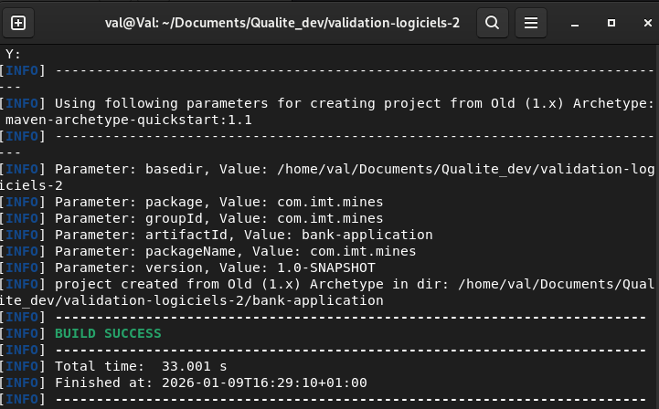
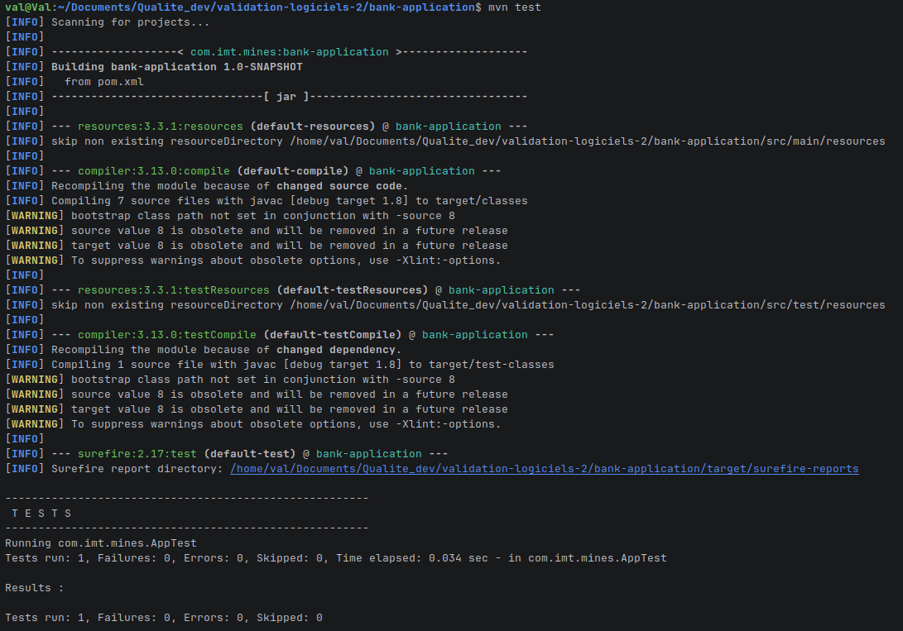
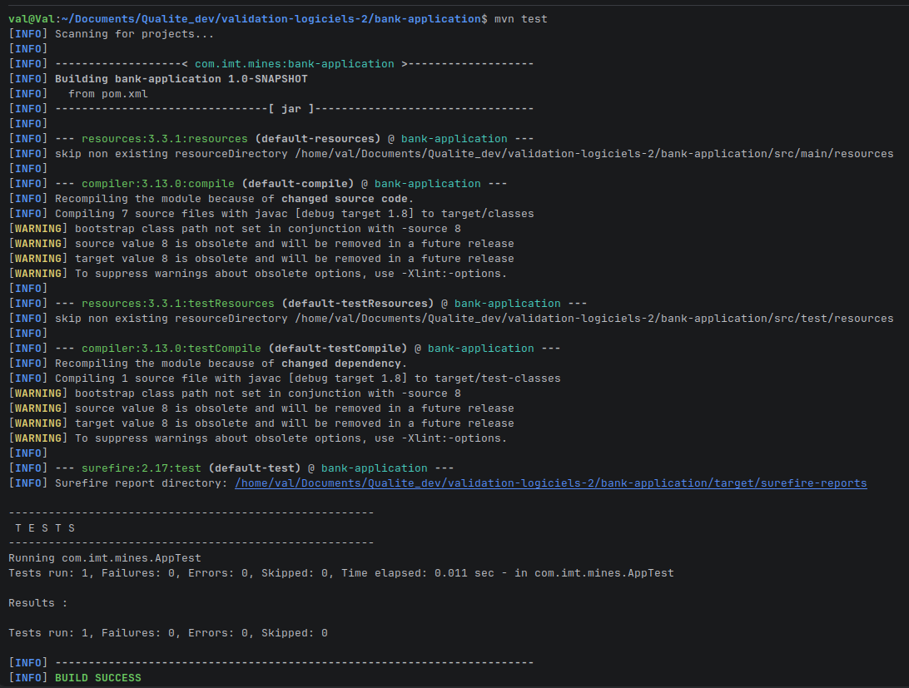
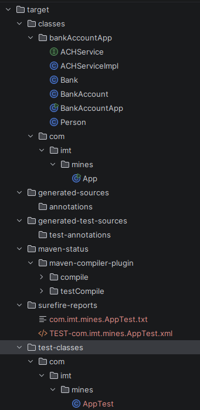
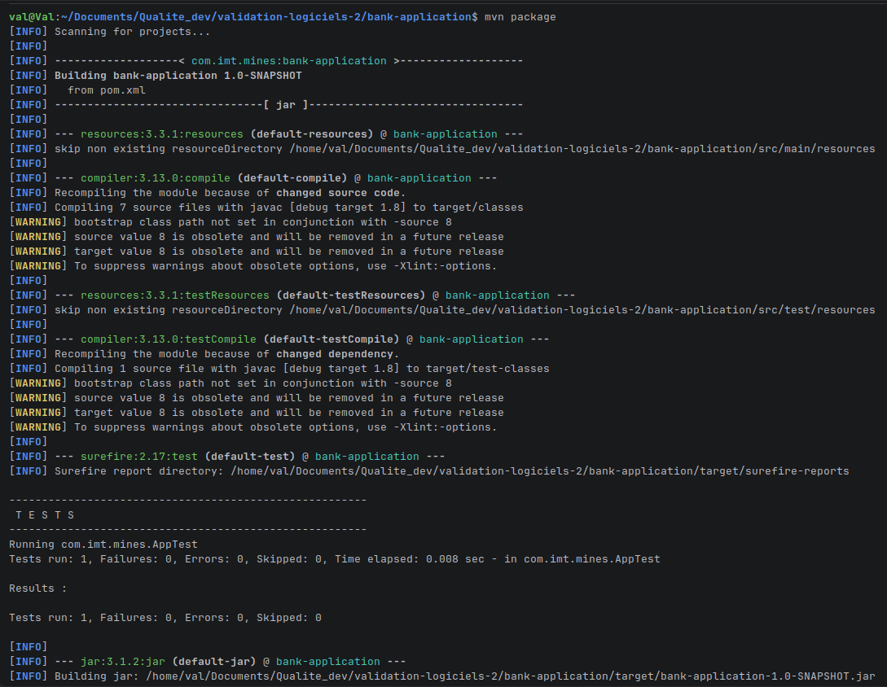

# Exercices
## Exercise 6 (Repo 2): Turn BankApplication into a Maven project

```bash
    mvn archetype:generate -DarchetypeArtifactId=maven-archetype-quickstart -DarchetypeVersion=1.1
```



## Exercise 7 (Repo 2): Add test dependencies and explore the Maven lifecycle
I updated the **junit** dependency to a more recent version and added **hamcrest**.
```xml
    <dependency>
      <groupId>junit</groupId>
      <artifactId>junit</artifactId>
      <version>4.12</version>
      <scope>test</scope>
    </dependency>
    <dependency>
      <groupId>org.hamcrest</groupId>
      <artifactId>hamcrest-library</artifactId>
      <version>1.3</version>
      <scope>test</scope>
    </dependency>
```
### mvn clean
**Phases :**  
- Deleting content of **/target** folder.

**Files/folders in target :**
- None

### mvn test
**Phases :**

- Validating ressources
- Compiling
- Tests
**Files/folders in target :**


### mvn package
**Phases :**

- Validating ressources
- Compiling
- Tests
- Packaging phase -> creates a .jar file of the project
**Files/folders in target :**
- Creates a jar file :


### mvn verify
**Difference from test :** 
mvn verify goes further than test in the phases by building the project as well.
**Difference from package :**
In theory, mvn verify runs integration tests as well compared to package. However, I wasn't able to see a difference on this project