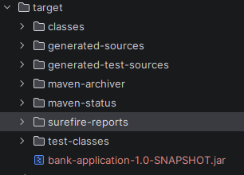
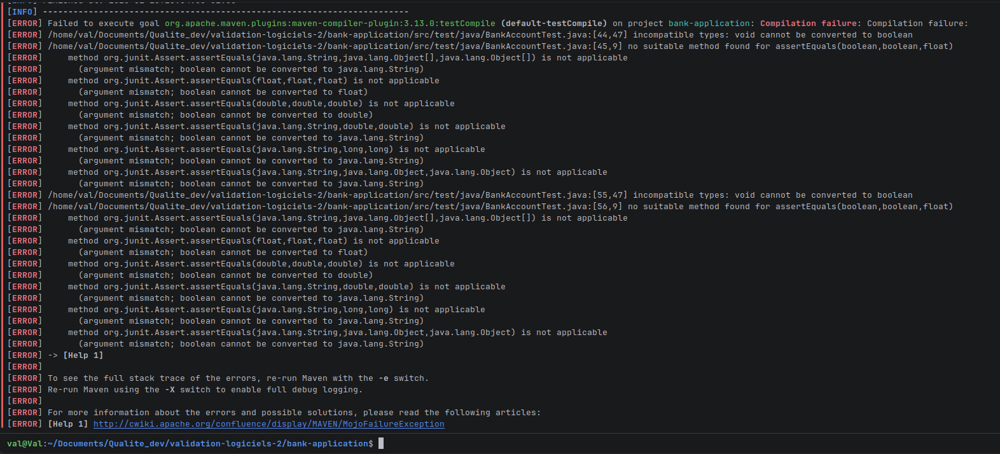
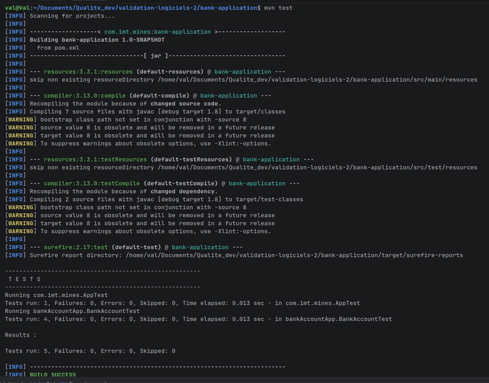
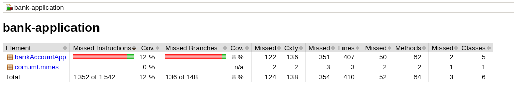
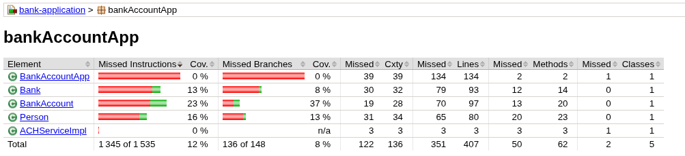
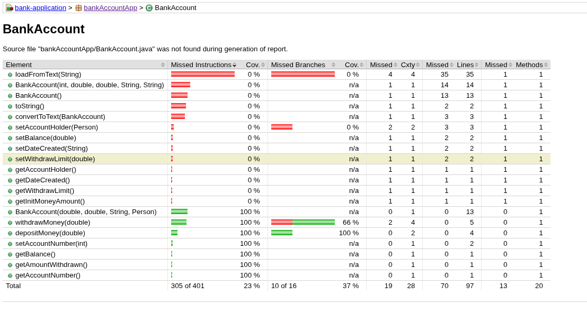
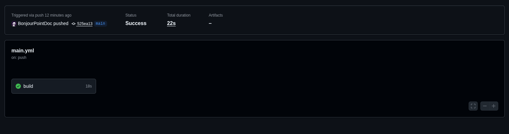
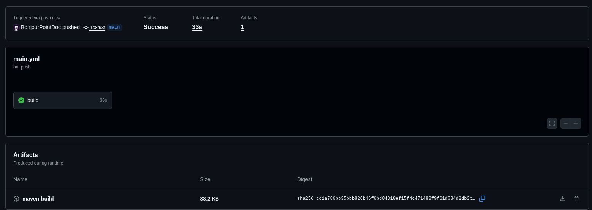
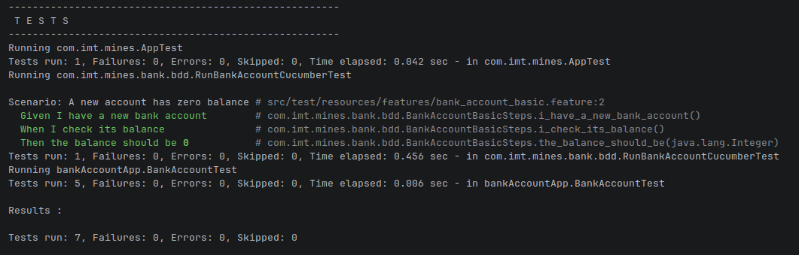

# Exercices
## Exercise 6 (Repo 2): Turn BankApplication into a Maven project

```bash
    mvn archetype:generate -DarchetypeArtifactId=maven-archetype-quickstart -DarchetypeVersion=1.1
```


## Exercise 7 (Repo 2): Add test dependencies and explore the Maven lifecycle
I updated the **junit** dependency to a more recent version and added **hamcrest**.
```xml
    <dependency>
      <groupId>junit</groupId>
      <artifactId>junit</artifactId>
      <version>4.12</version>
      <scope>test</scope>
    </dependency>
    <dependency>
      <groupId>org.hamcrest</groupId>
      <artifactId>hamcrest-library</artifactId>
      <version>1.3</version>
      <scope>test</scope>
    </dependency>
```
### mvn clean
**Phases :**  
- Deleting **/target** folder.

**Files/folders in target :**
- None

### mvn test
**Phases :**

- Validating resources
- Compiling
- Tests
**Files/folders in target :**


### mvn package
**Phases :**

- Validating resources
- Compiling
- Tests
- Packaging phase -> creates a .jar file of the project
**Files/folders in target :**
- Creates a jar file :


### mvn verify
**Difference from test :** 
mvn verify goes further than test in the phases by building the project as well.
**Difference from package :**
In theory, mvn verify runs integration tests as well compared to package. However, I wasn't able to see a difference on this project

## Exercise 8 (Repo 2): Write unit tests for the bank domain
I choose to test the deposit and withdraw methods :

### deposit
```java
    @Test
    public void test_deposit() { // Happy path test
        int deposit = 100;
        bank.addAccount(bankAccount, accountId);
    
        assertEquals(1000, bankAccount.getBalance(), 0f);
        boolean res = bankAccount.depositMoney(deposit);
        assertTrue(res);
        assertEquals(1100, bankAccount.getBalance(), 0f);
    }
    
    @Test
    public void test_deposit_fail() {  // Edge case test
        int deposit = -100;
        bank.addAccount(bankAccount, accountId);
    
        assertEquals(1000, bankAccount.getBalance(), 0f);
        boolean res = bankAccount.depositMoney(deposit);
        assertFalse(res);
        assertEquals(1000, bankAccount.getBalance(), 0f);
    }
```

### withdrawMoney()
```java
    @Test
    public void test_withdrawMoney() throws Exception { // Happy path test
        int withdraw = 100;
        bank.addAccount(bankAccount, accountId);
    
        assertEquals(1000, bankAccount.getBalance(), 0f);
        boolean res = bankAccount.withdrawMoney(withdraw);
        assertTrue(res);
        assertEquals(100, bankAccount.getAmountWithdrawn(), 0f);
        assertEquals(900, bankAccount.getBalance(), 0f);
    
    }
    
    @Test
    public void test_withdrawMoney_fail() throws Exception {  // Edge case test
        int withdraw = 6000;
        bank.addAccount(bankAccount, accountId);
    
        assertEquals(1000, bankAccount.getBalance(), 0f);
        boolean res = bankAccount.withdrawMoney(withdraw);
        assertFalse(res);
        assertEquals(0, bankAccount.getAmountWithdrawn(), 0f);
        assertEquals(1000, bankAccount.getBalance(), 0f);
    
    }   
```
I ran my tests, they failed as depositMoney does not return a boolean value.


My tests were correct so I decided to change that and adapted depositMoney accordingly :
```java
    public boolean depositMoney(double depositAmount) {
        if (depositAmount >= 0) {
            balance = balance + depositAmount;
            return true;
        }
        return false;
    }
```


## Exercise 9 (Repo 2): Increase coverage with JaCoCo
I added the JaCoCo plugin :
```xml
<build>
    <plugins>
      <plugin>
        <groupId>org.jacoco</groupId>
        <artifactId>jacoco-maven-plugin</artifactId>
        <version>0.8.11</version>
        <executions>
          <execution>
            <id>jacoco-initialize</id>
            <goals>
              <goal>prepare-agent</goal>
            </goals>
          </execution>
          <execution>
            <id>jacoco-site</id>
            <phase>verify</phase>
            <goals>
              <goal>report</goal>
            </goals>
          </execution>
        </executions>
      </plugin>
    </plugins>
  </build>
```
I then ran :
```bash
    mvn clean test
    mvn jacoco:report
``` 
I obtained this report :


For now, all my classes are low coverage :


I chose to test the method **getWithdrawLimit()** from the class **BankAccount** :


I added a simple test :
```java
    @Test
    public void test_withdrawMoney() throws Exception {
        assertEquals(500, bankAccount.getWithdrawLimit(), 0f);
    }
```
I reran **mvn clean test** and **mvn jacoco:report**, and the coverage has indeed increased :


## Exercise 10  (Repo 2): Extend a CI workflow (GitHub Actions)
**Initial workflow**
```yaml
name: Maven CI

on:
  push:
    branches:
      - main

jobs:
  build:
    runs-on: ubuntu-latest

    steps:
      - name: Checkout code
        uses: actions/checkout@v4

      - name: Set up JDK
        uses: actions/setup-java@v4
        with:
          distribution: 'temurin'
          java-version: '17'

      - name: Run tests
        working-directory: bank-application
        run: mvn clean test
```



**Extended version**
```yaml
name: Maven CI Extended

on:
  push:
    branches:
      - main

jobs:
  build:
    runs-on: ubuntu-latest

    steps:
      - name: Checkout code
        uses: actions/checkout@v4

      - name: Set up JDK
        uses: actions/setup-java@v4
        with:
          distribution: 'temurin'
          java-version: '17'

      - name: Run tests
        working-directory: bank-application
        run: mvn clean test

      - name: Package application
        working-directory: bank-application
        run: mvn package

      - name: Upload build artifact
        uses: actions/upload-artifact@v4
        with:
          name: maven-build
          path: target/
```


## Exercise 11 (Repo 2): Cucumber for BankAccount

J'ai complété les tests :

```java
    @Given("I have a new bank account")
    public void i_have_a_new_bank_account() {
        // TODO: create a new bank account with initial balance 0
        Person person = null;
        try {
            person = new Person( "Test", 'm', 22, 60, 172, "brown", "brown", "test@test.com");
        } catch (Exception e) {
            System.out.print("Unexpected failure during test setup creating accountHolder");
            e.printStackTrace();
        }
        account = new BankAccount(0, 1000, "10/01/2026", person);
    }

    @When("I check its balance")
    public void i_check_its_balance() {
        // TODO: read the balance from the account and store it in observedBalance
       observedBalance = account.getBalance();
    }

    @Then("the balance should be {int}")
    public void the_balance_should_be(Integer expected) {
        // TODO: assert that observedBalance equals expected
        // Example: assertEquals(expected.intValue(), observedBalance);
        assertEquals(expected.intValue(), (int)observedBalance);
    }
```

I then ran the tests using **mvn test** :



All tests pass.